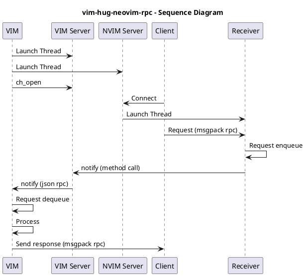

# vim-hug-neovim-rpc

This is an **experimental project**, trying to build a compatible layer for
[neovim rpc client](https://github.com/neovim/python-client) working on vim8.
I started this project because I want to fix the [vim8
support](https://github.com/roxma/nvim-completion-manager/issues/14) issue for
[nvim-completion-manager](https://github.com/roxma/nvim-completion-manager).

Since this is a general perpurse module, other plugins needing rpc support may
benefits from this project. However, there're many neovim rpc methods I havn't
implemented yet, which make this an experimental plugin. **Please fork and
open a PR if you get any idea on improving it**.


## Requirements

- vim8 with `has('python')` or `has('python3')`
- installation of
  [neovim/python-client](https://github.com/neovim/python-client). (`pip
  install neovim`). There should be no error when you execute `:python import
  neovim` or `:python3 import neovim`

## Overall Implementation

```
   "vim-hug-neovim-rpc - Sequence Diagram"
^^^^^^^^^^^^^^^^^^^^^^^^^^^^^^^^^^^^^^^^^^^^^


┌───┐            ┌──────────┐          ┌───────────┐          ┌──────┐              ┌────────┐
│VIM│            │VIM Server│          │NVIM Server│          │Client│              │Receiver│
└─┬─┘            └────┬─────┘          └─────┬─────┘          └──┬───┘              └───┬────┘
  │   Launch Thread   │                      │                   │                      │
  │───────────────────>                      │                   │                      │
  │                   │                      │                   │                      │
  │              Launch Thread               │                   │                      │
  │─────────────────────────────────────────>│                   │                      │
  │                   │                      │                   │                      │
  │      ch_open      │                      │                   │                      │
  │───────────────────>                      │                   │                      │
  │                   │                      │                   │                      │
  │                   │                      │      Connect      │                      │
  │                   │                      │ <──────────────────                      │
  │                   │                      │                   │                      │
  │                   │                      │               Launch Thread              │
  │                   │                      │ ─────────────────────────────────────────>
  │                   │                      │                   │                      │
  │                   │                      │                   │ Request (msgpack rpc)│
  │                   │                      │                   │ ─────────────────────>
  │                   │                      │                   │                      │
  │                   │                      │                   │                      │────┐
  │                   │                      │                   │                      │    │ Request enqueue
  │                   │                      │                   │                      │<───┘
  │                   │                      │                   │                      │
  │                   │                      │notify (method call)                      │
  │                   │ <────────────────────────────────────────────────────────────────
  │                   │                      │                   │                      │
  │ notify (json rpc) │                      │                   │                      │
  │<───────────────────                      │                   │                      │
  │                   │                      │                   │                      │
  ────┐                                      │                   │                      │
      │ Request dequeue                      │                   │                      │
  <───┘                                      │                   │                      │
  │                   │                      │                   │                      │
  ────┐               │                      │                   │                      │
      │ Process       │                      │                   │                      │
  <───┘               │                      │                   │                      │
  │                   │                      │                   │                      │
  │                 Send response (msgpack rpc)                  │                      │
  │──────────────────────────────────────────────────────────────>                      │
┌─┴─┐            ┌────┴─────┐          ┌─────┴─────┐          ┌──┴───┐              ┌───┴────┐
│VIM│            │VIM Server│          │NVIM Server│          │Client│              │Receiver│
└───┘            └──────────┘          └───────────┘          └──────┘              └────────┘
```



## Debugging

```sh
NVIM_PYTHON_LOG_FILE=nvim.log NVIM_PYTHON_LOG_LEVEL=DEBUG vim
```

## Known isues

- [delay on vim8 exit](https://github.com/roxma/nvim-completion-manager/issues/52)

